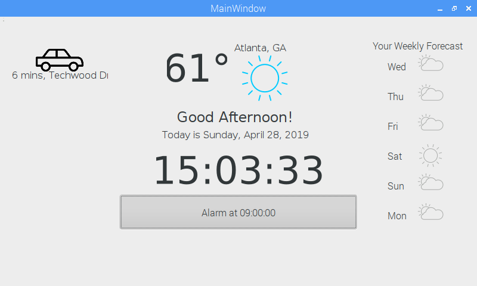
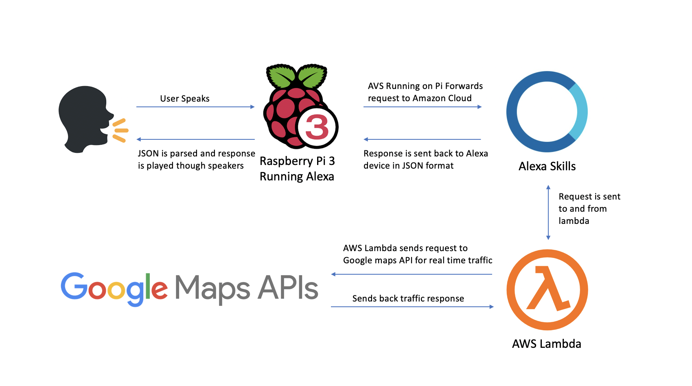

## Contents

* TOC
{:toc}

## Authors

- Dylan Verstandig
- Jacob Lattie
- Peter Nguyen

## Project Overview

The Smart Alarm Clock is a responsive graphical user interface for quickly recieving information about your day. Powered by a Raspberry Pi 3 and developed with Alexa Voice Services, the Smart Alarm Clock will keep you prepared.

## Gallery



[DemoVid](https://www.youtube.com/watch?v=yNKB0Weq6vo)

## Hardware and Software

### Hardware

```
Raspberry Pi 3
Adafruit 7" 800x480 HDMI Backpack
USB Microphone
Auxiliary Speaker
```

### Software

```
Alexa Voice Services (AVS)
Alexa Developer Console
AWS Lambda
Qt Creator
PyQt5
```
### High Level Diagram of Software Architecture


## Alexa Environment

### Setting up an Alexa Skill
 1. Log on to https://developer.amazon.com/ and create a developer account 
 2. In the Alexa Developer Console, click on "Create Skill"
 3. Select "Custom Skill" and "Start from Scratch"
 4. Click on the "Json Editor" Tab on the left side of the screen and copy paste the skills.json file found in the models   folder of this github
 5. Under Service Endpoint type, select "AWS Lambda ARN" and copy the skill ID onto your clipboard
 6. Under Permissions, allow the skill to use the devices full address
 
### Setting up Google Maps API

 1. Go to https://developers.google.com/console and create an account (You might need to input credit card information for billing)
 2. Create a new Project
 3. Enable the following APIs:
 ```
Directions API
Distance API
Geocoding API	
Geolocation API	
Maps Elevation API
Places API
```
 4. Create a new API key and copy it to your clipboard
 
### Setting up AWS Lambda

 1. Log on to https://aws.amazon.com/ and create an account (You might need to input credit card information for billing)
 2. Under Location, make sure it is specified as "US-East (N. Virginia)"
 3. Select Lambda from the available services and click on "Create Function"
 4. Select "Author from Scratch" and name your lambda function
 5. Select pyhton 3.7 as the runtime, and "lambda_basic_execution" as the execution role
 6. Click on the "Create Function" button
 7. Under "Add Triggers", select "Alexa SKills Kit" and copy paste the skill id in you clipboard
 8. Under "Code Entry Type", select "Upload from ZIP"
 9. Upload a zip file of the "Lamdba.py" code found in this github along with the necesary libraries (In this case googlemaps,  ask-sdk-core and ask-sdk-model are all required)
 10. In the Environment Variables Section, Enter the Following:
 ```
API_KEY	             |     API Key created in step 4 of "Setting Up Google Maps API"
COUNTRY	             |     "Home Country"
WORK	             |     "Work Address"
HOME	             |     "Home Address"
```
 11. Click save and copy the ARN number found on the top right of the function
 12. Copy paste the ARN number in the Alexa Developer Console under "Enpoint"
 
### Setting up Alexa on the Raspberry Pi

 1. Download Raspian OS (NOOBS_v2_9_0 or newer)
 2. Run the follwing commands on the raspberry pi:
 ```
 wget https://raw.githubusercontent.com/alexa/avs-device-sdk/master/tools/Install/setup.sh \
 wget https://raw.githubusercontent.com/alexa/avs-device-sdk/master/tools/Install/genConfig.sh \
 wget https://raw.githubusercontent.com/alexa/avs-device-sdk/master/tools/Install/pi.sh
```
3. Go to https://developer.amazon.com/alexa/console/avs/products and click create a new product
4. Name it "Raspberry Pi"
5. Under "Security Profile", navigate down to "Other devices and platforms"
6. Click on download and save the file as "config.json"
7. Place this file in you /home/pi directory
8. Run the follwing commands:
```
cd /home/pi/
sudo bash setup.sh config.json [-s 1234]
```
9. Type in "AGREE" and wait for the porject to build
10. To run Alexa on the App, run the follwing:
```
cd /home/pi/
sudo bash startsample.sh
 ```
11. Follow the instructions in the terminal window to authenticate the device, by login on to amazon and entering the unique code found in the terminal

### Running Alexa
To Run:
 ```
cd /home/pi/
sudo bash startsample.sh
 ```
To Build:
```
 cd /home/pi/build/SampleApp
sudo make
 ```

 
## GUI Environment

Our group used [PyQt](https://wiki.python.org/moin/PyQt) and Qt Creator to produce the Graphical User Interface for our alarm clock. By using QtCreator to set the intitial UI design of the application, we were able to quickly initialize any widgets needed. We chose PyQt over Qt5.12(C++) due to the ease of use when delpoying Python3 based code on the Raspberry Pi. In doing so, we avoided any cross compling errors when working between OSX and Raspian Jessie OS. 

Below are the packages and dependencies needed to get your own Smart Alarm up and running.

### Development Machine

First, if on OSX, use [homebrew](https://brew.sh/) to install required packages:
```
brew install python3
brew install qt5
brew install pyqt5
```
Now, on the machine you are developing on, download [QtCreator](https://www.qt.io/download) to begin creating the UI of the Smart Alarm Clock:
```
Qt Creator Example
```
After editing the .ui file, simply run the following command to convert the .ui file into a python class that initializes the MainWindow object of your GUI as well as any widgets declared from Qt Creator:
```
pyuic5 mainwindow.ui > mainwindow_init.py
```
As a debug step, I often ran the GUI code on my personal machine to preview any functionalities I implemented. To do so, create a main.py file to run the PyQt application. The following code serves as a good skeleton file when building the functionality of the other widgets in your GUI:
 
``` python
import sys
import PyQt5
from PyQt.QtWidgets import *
import mainwindow_init

# Main Window of GUI
class MainWindow(QMainWindow, mainwindow_init.Ui_MainWindow):
    # Call setup for widgits in mainwindow_init
    def __init__(self):
        super(self.__class__, self).__init__()
        self.setupUi(self)

        # Timer connect every second
        self.time_label.setAlignment(Qt.AlignCenter)
        timer = QTimer(self)
        timer.timeout.connect(self.showTime)
        timer.start()

    # Date Label Connect Function to display digital time
    def showTime(self):
        time = QTime.currentTime()
        time_text = time.toString('hh:mm:ss')
        if (time.second() % 2) == 0:
            time_text = time_text[:2] + ' ' + time_text[3:]
            time_text = time_text[:5] + ' ' + time_text[6:]
        self.time_label.setText(time_text)

# Create Application in main
def main():
    app = QApplication(sys.argv)
    form = MainWindow()
    form.show()
    sys.exit(app.exec_())

# Script in Python3
if __name__ == "__main__":
    main()
```

Let's recap. Your project folder should contain the following files (we can ignore the .cpp and .h extensions). Transport the following files from your development machine to the Raspberry Pi:
```
|__Project_Directory
   |__main.py
   |__mainwindow.ui
   |__mainwindow_init.py
```

### Running the Raspberry Pi GUI

Finally, on your Raspberry Pi, use the apt-get command to download the packages needed to display your new GUI:
```
sudo apt-get install python3
sudo apt-get install python3-pyqt5
```
Navigate to your project directory and execute the main file to visualize your PyQt GUI!
```
python3 main.py
```


## Original README 

You can use the [editor on GitHub](https://github.com/Dverstandig/4180-Smart-Alarm-Clock/edit/master/README.md) to maintain and preview the content for your website in Markdown files.

Whenever you commit to this repository, GitHub Pages will run [Jekyll](https://jekyllrb.com/) to rebuild the pages in your site, from the content in your Markdown files.

### Markdown

Markdown is a lightweight and easy-to-use syntax for styling your writing. It includes conventions for

```markdown
Syntax highlighted code block

# Header 1
## Header 2
### Header 3

- Bulleted
- List

1. Numbered
2. List

**Bold** and _Italic_ and `Code` text

[Link](url) and 
```

For more details see [GitHub Flavored Markdown](https://guides.github.com/features/mastering-markdown/).

### Jekyll Themes

Your Pages site will use the layout and styles from the Jekyll theme you have selected in your [repository settings](https://github.com/Dverstandig/4180-Smart-Alarm-Clock/settings). The name of this theme is saved in the Jekyll `_config.yml` configuration file.

### Support or Contact

Having trouble with Pages? Check out our [documentation](https://help.github.com/categories/github-pages-basics/) or [contact support](https://github.com/contact) and we’ll help you sort it out.
